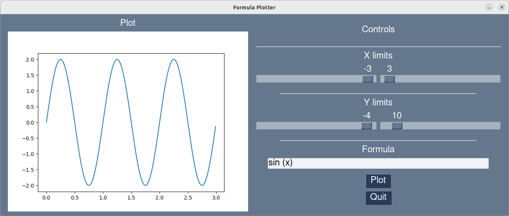

# Math function plotter

## Overview
Plots mathematical functions inputted by user.
This works by evaluating a function with module [py-expression](https://pypi.org/project/py-expression/), creating a function graph with [Matplotlib](https://matplotlib.org/). This function graph is displayed in a Graphical User interface * (GUI) * [PySimpleGUI](https://www.pysimplegui.org). Sliders allow selection of ranges to be plotted. 

## Installation
You should get a copy of the code using `git clone`.

`git clone https://github.com/hermonochy/functionplotter.git`

If `git` is not on your system, you may install it with
`sudo apt install git` on linux or with `brew install git` on Mac OS X.
If you use MS Windows, find out yourself. Hint: There is a git console for Windows. 

It's recommended to use [virtual environments](https://frankcorso.dev/setting-up-python-environment-venv-requirements.html) as below to avoid headaches with Python module conflicts. 

### Create a virtual environment for Python:
`python -m venv .`

### Activate virtual environment:
`source ./bin/activate`

### Install dependencies inside virtual environment
`pip3 install -r requirements.txt `

### Start program
`python3 guiplot.py `

## Future work
- GUI error messages.
- 2D/3D plot
- Widgets for fine grained definition area.
- Multilot with listbox selection.
